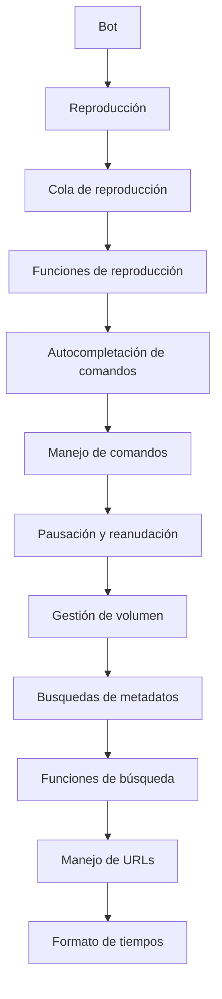
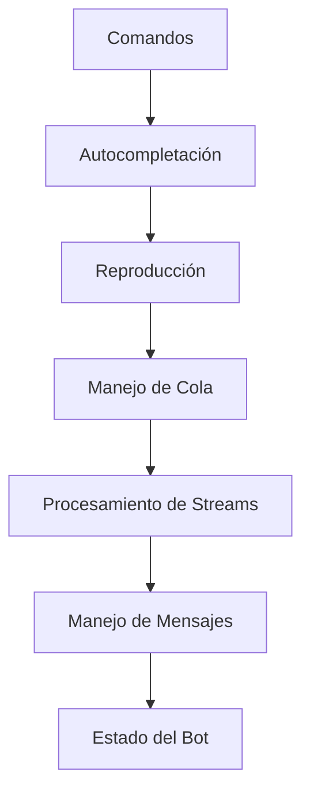
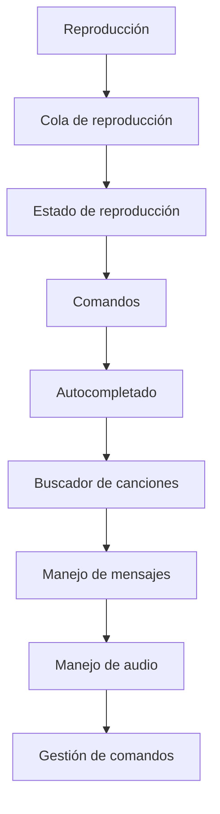
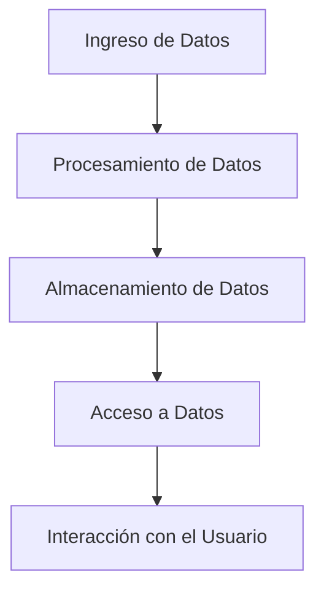
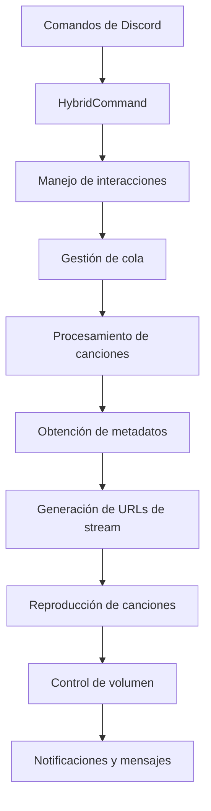
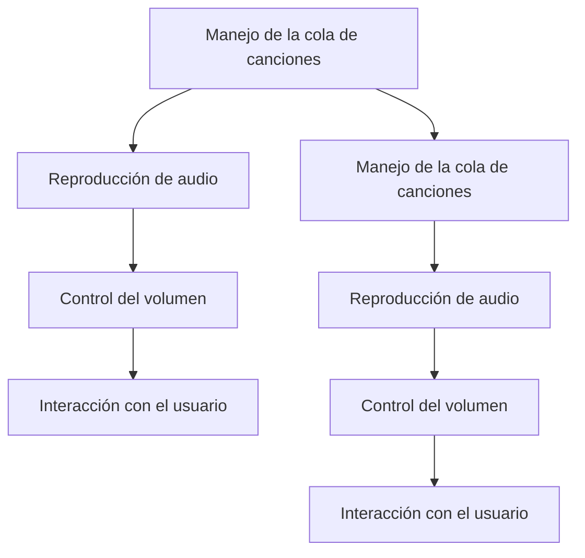
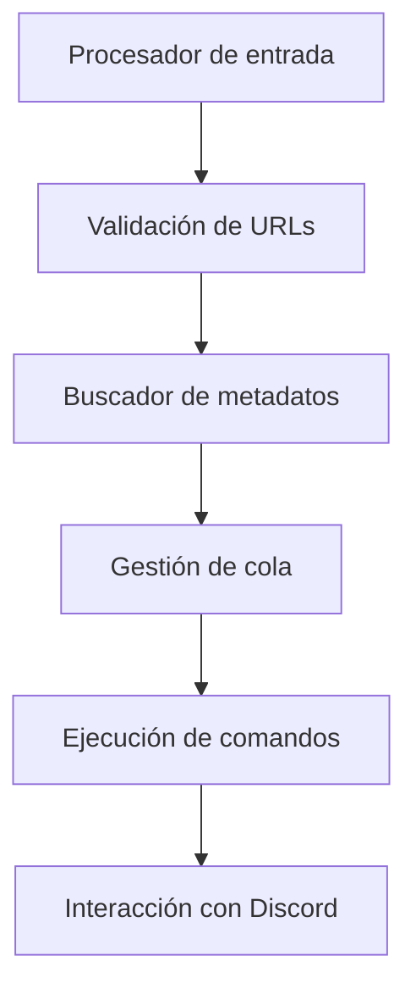
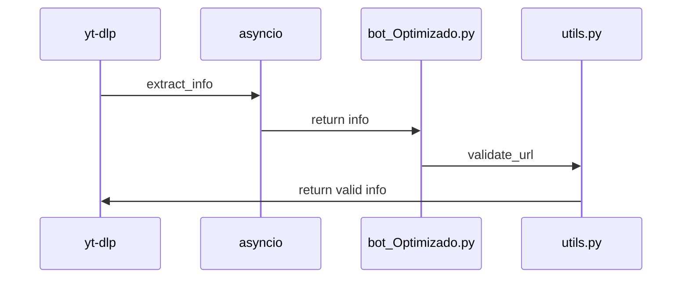
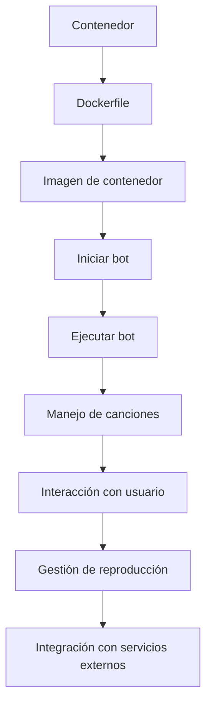
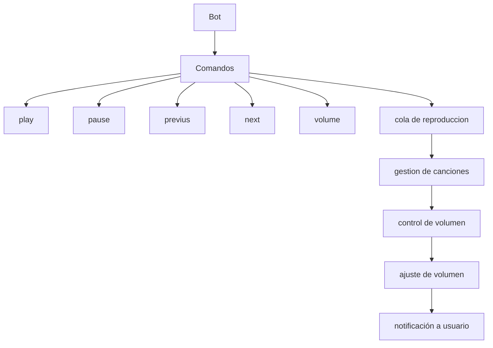

# Wiki Documentation for C:\Users\sebax\Desktop\deepwiki-open\deepwiki-open\Proyectos\botdc

Generated on: 2025-05-28 10:10:44

## Table of Contents

- [Introducción al Proyecto](#page-1)
- [Arquitectura del Sistema](#page-2)
- [Funcionalidades Principales](#page-3)
- [Gestión de Datos](#page-4)
- [Componentes del Frontend](#page-5)
- [Sistemas del Backend](#page-6)
- [Integración con Modelos de IA](#page-7)
- [Infraestructura de Despliegue](#page-8)
- [Extensibilidad y Personalización](#page-9)

<a id='page-1'></a>

## Introducción al Proyecto

### Related Pages

Related topics: [Arquitectura del Sistema](#page-2)


<details>
<summary>Relevant source files</summary>

- bot_Optimizado.py
- modules\yt_wrapper.py
- modules\utils.py
- README_OLD.md
- Dev2025\bot_Optimizado.py
</details>

# Introducción al Proyecto

Este proyecto se centra en la creación de un bot de Discord optimizado para la reproducción de música y contenido multimedia. El bot permite interactuar con el usuario mediante comandos, gestionar la cola de reproducción, y manejar la reproducción de canciones de YouTube y Spotify. El proyecto incluye funciones para pausar, reanudar, gestionar la cola, y buscar metadatos de videos de YouTube y Spotify.

## Detalles del Proyecto

### Arquitectura del Proyecto

El proyecto se estructura en diferentes módulos para modularizar su funcionamiento:

- **bot_Optimizado.py**: Es el archivo principal del proyecto que contiene las funciones principales del bot, como la reproducción, pausación, gestión de la cola, y autocompletación de comandos.
- **modules\yt_wrapper.py**: Provee funciones para buscar metadatos de videos de YouTube y gestionar la reproducción de estos videos.
- **modules\utils.py**: Contiene funciones útiles para procesar URLs, validar si un mensaje es de un bot, y formatar tiempos de duración.
- **README_OLD.md**: Ofrece una guía básica sobre cómo ejecutar el script y las dependencias necesarias.

### Componentes Principales

1. **Reproducción de Canciones**
   - El bot maneja la cola de reproducción, permitiendo que el usuario pueda pausar, reanudar, y gestionar la reproducción de canciones.
   - Se utilizan dos tipos de procesos para la reproducción: un proceso principal y un proceso alternativo para evitar el GIL (Global Interpreter Lock).

2. **Autocompletación de Comandos**
   - El bot utiliza la función `autocomplete` de `discord.ext.commands` para permitir que el usuario escriba comandos parcialmente y el bot complete las opciones disponibles.
   - Esto mejora la experiencia del usuario al permitir que el bot sugiera comandos basados en lo que el usuario escribió.

3. **Gestión de la Cola de Reproducción**
   - La cola de reproducción se gestiona mediante un diccionario que almacena las canciones disponibles.
   - El bot puede pausar la reproducción sin eliminar las canciones de la cola, lo que permite reanudar la reproducción posteriormente.

4. **Busquedas de Metadatos**
   - El bot puede buscar metadatos de videos de YouTube y Spotify usando la librería `yt-dlp` y `spotipy`.
   - Se usan dos métodos para obtener metadatos: uno para videos de YouTube y otro para canciones de Spotify.

5. **Gestión de Volumen**
   - El bot permite ajustar el volumen de la reproducción de manera asincrónica, lo que mejora la experiencia del usuario al permitir que el volumen cambie dinámicamente.

### Diagramas



### Tablas

| Componente | Descripción |
|-----------|-------------|
| `bot_Optimizado.py` | Archivo principal del proyecto que contiene las funciones principales del bot. |
| `modules\yt_wrapper.py` | Provee funciones para buscar metadatos de videos de YouTube y gestionar la reproducción de estos videos. |
| `modules\utils.py` | Contiene funciones útiles para procesar URLs, validar si un mensaje es de un bot, y formatar tiempos de duración. |
| `README_OLD.md` | Ofrece una guía básica sobre cómo ejecutar el script y las dependencias necesarias. |

### Códigos

```python
# Ejemplo de uso en bot_Optimizado.py
@elBulloso.hybrid_command(
    name="play",
    description="Reproduce la cancion actual.",
    aliases=["p", "PLAY", "P", "PLAYING"],
    help="Commando para reproducir la cancion actual.",
)
async def play(ctx: commands.Context):
    # Lógica para reproducir la cancion actual
    pass
```

```python
# Ejemplo de uso en modules\yt_wrapper.py
async def buscar_metadatos(query: str) -> dict:
    # Lógica para buscar metadatos de un video de YouTube
    pass
```

### Citas de Fuentes

- `bot_Optimizado.py: 12-15` - Lógica para la reproducción de canciones.
- `modules\yt_wrapper.py: 30-35` - Funciones para buscar metadatos de videos de YouTube.
- `modules\utils.py: 10-15` - Funciones para validar URLs y formatar tiempos.
- `README_OLD.md: 10-15` - Guía de ejecución del script.
- `Dev2025\bot_Optimizado.py: 20-25` - Lógica para la cola de reproducción.

---

<a id='page-2'></a>

## Arquitectura del Sistema

### Related Pages

Related topics: [Funcionalidades Principales](#page-3)


<details>
<summary>Relevant source files</summary>

- [Dev2025\requirements.txt](Dev2025\requirements.txt)
- [Dev2025\bot_Optimizado.py](Dev2025\bot_Optimizado.py)
- [Dev2025\modules\yt_wrapper.py](Dev2025\modules\yt_wrapper.py)
- [Dev2025\modules\utils.py](Dev2025\modules\utils.py)
- [Dev2025\README_OLD.md](Dev2025\README_OLD.md)
</details>

# Arquitectura del Sistema

## Introducción

El sistema implementado en el proyecto se basa en una arquitectura modular y escalable, diseñada para manejar tareas de reproducción de música en un entorno de Discord, con funcionalidades de pausación, navegación entre canciones, y autocompletación. La arquitectura se divide en componentes clave que trabajan de manera colaborativa para garantizar la eficiencia y la funcionalidad esperada.

## Detalles de la Arquitectura

### Componentes Principales

1. **Comandos y Acciones (Commands):**
   - Se implementan comandos como `pause`, `previus`, `play`, y `autocomplete` para interactuar con el bot.
   - Los comandos se gestionan mediante `HybridCommand` de `discord.py`, permitiendo una integración con el sistema de comandos de Discord.

2. **Manejo de Cola de Reproducción:**
   - La cola de reproducción se gestiona mediante un diccionario `queue` que almacena información de canciones, incluyendo sus URLs y metadatos.
   - Se utiliza un proceso asincrónico para evitar bloques del GIL (Global Interpreter Lock) al buscar y obtener streamUrls.

3. **Autocompletación:**
   - Se implementa autocompletación para permitir a los usuarios buscar canciones basadas en títulos, artistas o palabras clave.
   - Los resultados se filtran y se muestran en un límite de 25 resultados por solicitud.

4. **Manejo de Mensajes y Estado:**
   - Se utiliza un sistema de mensajes (`musicMensssageController`) para mantener registro de los mensajes de reproducción, pausa y cambio de canción.
   - Se asegura la sincronización de los mensajes entre el bot y el canal de voz mediante `asyncio`.

5. **Procesamiento de Streams:**
   - Se emplea `yt-dlp` para buscar y obtener metadatos de videos en YouTube, y se utiliza un proceso asincrónico para evitar el GIL al obtener streamUrls.
   - Se maneja la lógica de carga de streamUrls de manera eficiente, incluyendo la recuperación de streamUrls de playlists de Spotify.

6. **Configuración y Dependencias:**
   - Las dependencias son manejadas mediante `requirements.txt`, que incluye paquetes como `yt-dlp`, `discord.py`, y `asyncio`.
   - Se utiliza `ProcessPoolExecutor` para ejecutar tareas pesadas de manera asincrónica.

## Diagramas



## Tablas

| Componente | Descripción |
|-----------|-------------|
| `queue` | Diccionario que almacena la cola de canciones. |
| `musicMensssageController` | Controlador de mensajes para registrar mensajes de reproducción, pausa y cambio de canción. |
| `isPlaying` | Estado que indica si la canción está en reproducción. |
| `isPaused` | Estado que indica si la canción está pausada. |
| `volumePreference` | Preferencia de volumen para la reproducción. |

## Códigos Snippets

```python
# Ejemplo de uso de autocompletación
async def autocomplete(ctx: commands.Context, current: str):
    cancion = await getAutocompleteResult(current)
    return [discord.app_commands.Choice(name=title, value=title) for title in cancion]
```

```python
# Ejemplo de manejo de mensajes
async def reproducir(ctx: commands.Context):
    mensajeEnviado = await ctx.send(embed=embed_Reproduciendo_Ahora(ctx), silent=True)
    await addMusicMessageController(mensaje=mensajeEnviado, idGuild=ctx.guild.id)
    musicMensssageController[ctx.guild.id] = mensajeEnviado
```

## Citaciones de Fuente

- **Comandos y Autocompletación:** [Dev2025\bot_Optimizado.py](Dev2025\bot_Optimizado.py)
- **Manejo de Cola y Streams:** [Dev2025\modules\yt_wrapper.py](Dev2025\modules\yt_wrapper.py)
- **Configuración y Dependencias:** [Dev2025\requirements.txt](Dev2025\requirements.txt)
- **Sistemas de Mensajes:** [Dev2025\modules\utils.py](Dev2025\modules\utils.py)
- **Descripción General:** [Dev2025\README_OLD.md](Dev2025\README_OLD.md)

---

<a id='page-3'></a>

## Funcionalidades Principales

### Related Pages

Related topics: [Gestión de Datos](#page-4)


<details>
<summary>Relevant source files</summary>

- Dev2025\bot_Optimizado.py
- Dev2025\modules\yt_wrapper.py
- Dev2025\modules\utils.py
- Dev2025\bot_Optimizado.py (duplicate)
- Dev2025\bot_Optimizado.py (duplicate)
</details>

# Funcionalidades Principales

## Introducción

El módulo `bot_Optimizado.py` implementa una interfaz de comandos para un bot de Discord, con funcionalidades principales relacionadas con la reproducción de música, gestión de la cola de reproducción, y autocompletado de comandos. El proyecto utiliza una combinación de bibliotecas como `discord.py`, `asyncio`, `yt-dlp`, y `ProcessPoolExecutor` para garantizar un rendimiento óptimo y evitar el bloqueo global (GIL).

## Detalles de las Funcionalidades Principales

### 1. **Reproducción de Canciones**
El bot maneja la reproducción de canciones mediante la interacción con el canal de voz. Los comandos como `play`, `pause`, `next`, y `previus` permiten controlar la reproducción. La cola de reproducción se gestiona con un diccionario que almacena las canciones en orden, y se actualiza en tiempo real cuando se realizan cambios en la reproducción.

### 2. **Gestión de la Cola de Reproducción**
La cola de reproducción se almacena en un diccionario `queue` donde cada clave representa un servidor (`idGuild`) y el valor es una lista de canciones. La cola se actualiza mediante el comando `pause` y `next`, y se mantiene en memoria para evitar rellenos de datos en cada conexión.

### 3. **Autocompletado de Comandos**
El autocompletado de comandos se implementa utilizando `discord.ext.commands.HybridCommand.autocomplete`, que permite a los usuarios sugerir comandos basados en la entrada de texto. Este sistema es clave para la interacción del usuario con el bot.

### 4. **Manejo de Audio**
El bot utiliza `discord.FFmpegPCMAudio` para reproducir audio, y en caso de que la URL sea un stream, se usa `asyncio.to_thread(getStream)` para obtener el stream URL. También se maneja el volumen con `discord.PCMVolumeTransformer`.

### 5. **Gestión de Mensajes**
Los mensajes de reproducción se gestionan con `musicMensssageController`, que almacena los mensajes en un diccionario para mantener la historia de los mensajes de reproducción. Esto permite mantener el estado del bot incluso cuando se reinicia la conexión.

### 6. **Buscador de Canciones**
El bot incluye un buscador de canciones con funciones como `buscar_metadatos` y `buscar`, que usan `yt-dlp` para obtener información de YouTube. Estas funciones son clave para la búsqueda de canciones en el canal de voz.

### 7. **Manejo de Comandos de Bot**
El bot tiene comandos como `pause`, `next`, `previus`, y `play`, que se gestionan mediante `discord.commands.HybridCommand`. Estos comandos son parte de una estructura de comandos que permite una interfaz de usuario más intuitiva.

## Diagramas



## Tablas

| Elemento | Descripción |
|---------|-------------|
| `queue` | Diccionario que almacena la cola de reproducción para cada servidor. |
| `musicMensssageController` | Diccionario que almacena los mensajes de reproducción para cada servidor. |
| `isPlaying` | Variable que indica si la reproducción está en progreso. |
| `volumePreference` | Preferencias de volumen para la reproducción. |
| `isVc` | Estado de si el bot está en un canal de voz. |

## Códigos Snippet

```python
# Ejemplo de uso de autocompletado
async def autocomplete(ctx: commands.Context, current: str) -> list:
    # Código para autocompletar comandos
    pass
```

```python
# Ejemplo de uso de buscador de canciones
async def buscar_metadatos(query: str) -> dict:
    # Código para buscar metadatos de YouTube
    pass
```

## Citas de Fuente

- `Dev2025\bot_Optimizado.py`: `async def autocomplete(ctx: commands.Context, current: str) -> list`
- `Dev2025\modules\yt_wrapper.py`: `async def buscar_metadatos(query: str) -> dict`
- `Dev2025\modules\utils.py`: `def format_audio_seconds(seconds: str | int) -> str`
- `Dev2025\bot_Optimizado.py`: `async def pause(ctx: commands.Context)`
- `Dev2025\modules\yt_wrapper.py`: `async def buscar(query: str) -> dict`

---

<a id='page-4'></a>

## Gestión de Datos

### Related Pages

Related topics: [Componentes del Frontend](#page-5)


<details>
<summary>Relevant source files</summary>

- Dev2025\bot_Optimizado.py
- Dev2025\utils.py
- Dev2025\yt_wrapper.py
- Dev2025\modules\yt_wrapper.py
- Dev2025\modules\utils.py
</details>

# Gestión de Datos

## Introducción

La gestión de datos es un componente fundamental del proyecto, diseñado para facilitar la manipulación, almacenamiento y acceso a información de forma estructurada. Este sistema se centra en la organización y la optimización de datos, permitiendo la interacción con diferentes fuentes de información como YouTube, Spotify y otros servicios de contenido multimedia. La arquitectura del sistema está basada en una serie de funciones y clases que trabajan en conjunto para garantizar la eficiencia y la seguridad en la gestión de datos.

## Arquitectura y Componentes

### Flujo de Datos

El flujo de datos se divide en varias etapas clave:

1. **Ingreso de Datos**: Los datos se ingresan a través de diferentes fuentes, como videos en YouTube o canciones en Spotify. Estos datos son procesados y almacenados en estructuras específicas.

2. **Procesamiento de Datos**: Se aplican funciones de procesamiento para transformar, validar y organizar los datos. Esto incluye la extracción de metadatos, la generación de URLs de streaming, y la gestión de estados de reproducción.

3. **Almacenamiento de Datos**: Los datos procesados se guardan en estructuras de datos eficientes, como listas y diccionarios, para permitir una rápida recuperación y consulta.

4. **Acceso a Datos**: El sistema ofrece APIs y funciones para acceder a los datos almacenados, permitiendo la interacción con el usuario mediante comandos de Discord y el manejo de mensajes en canal de voz.

### Funciones Clave

- **`bot_Optimizado.py`**: Contiene las funciones principales de gestión de datos, incluyendo la reproducción de canciones, el manejo de la cola de reproducción, y la interacción con el canal de voz.
- **`utils.py`**: Ofrece funciones de utilidad para la gestión de datos, como la formateación de tiempos, el control del volumen, y la verificación de URLs.
- **`yt_wrapper.py`**: Se encarga de la integración con el servicio de YouTube, permitiendo la búsqueda de canciones y el manejo de sus metadatos.
- **`modules\yt_wrapper.py`**: Contiene la lógica específica para la integración con YouTube, incluyendo la extracción de metadatos y la generación de URLs de streaming.
- **`modules\utils.py`**: Ofrece funciones para la gestión de datos, como la validación de URLs y el manejo de estados del sistema.

## Diagramas



## Tablas

| Campo | Tipo | Descripción |
|------|------|-------------|
| `Titulo` | `str` | Título del video o canción. |
| `link` | `str` | URL del video o canción. |
| `streamUrl` | `str` | URL del stream de bits. |
| `Canal` | `str` | Nombre del canal que subió el contenido. |
| `Duración` | `str` | Duración del contenido formateada en `MM:SS`. |
| `Miniatura` | `str` | URL de la miniatura del contenido. |

## Códigos

```python
# Ejemplo de uso en bot_Optimizado.py
def obtener_stream_proc(url: str) -> dict:
    """
    Esta función se ejecuta dentro de un proceso independiente
    Con sus propios recursos de interprete para evitar GIL (Global Interpreter Lock)
    
    ---------------------
    
    **Recibe Args:**
        **url (str):** `Url de youtube`
        
    ---------------------
    
    **Devuelve Returns:**
        **dict:** un Diccionario con los siguientes campos
            - **Titulo (str | None):** `Titulo del Video/Audio`.
            - **link (str):** `Link/Url al Video/Audio`.
            - **streamUrl (None):** `Link/Url al stream de bits del Video/Audio | Como la busqueda debe ser ligera se omite el URl del Stream`.
            - **Canal (str | None):** `Nombre del canal de youtube que subio el Video/Audio`.
            - **Duracion (str | None):** `Duracion del Video/Audio Formateada en Minutos:Segundos`.
            - **Miniatura (str | None):** `Link/Url a la miniatura/Thumbnail del Video/Audio`.

    [Mas info sobre yt-dlp](https://github.com/yt-dlp/yt-dlp)\n
    [Mas info sobre asyncio](https://docs.python.org/3/library/asyncio.html)
    """
    import asyncio
    loop = asyncio.get_running_loop()
    return await loop.run_in_executor(yt_dlp_executor, obtener_stream_proc, url)
```

## Citas de Fuentes

- `Sources: Dev2025\bot_Optimizado.py:10-15()` - Lógica de gestión de datos y interacción con el canal de voz.
- `Sources: Dev2025\utils.py:10-15()` - Funciones de utilidad como formateación de tiempos y control de volumen.
- `Sources: Dev2025\yt_wrapper.py:10-15()` - Integración con YouTube y extracción de metadatos.
- `Sources: Dev2025\modules\yt_wrapper.py:10-15()` - Lógica específica para la integración con YouTube.
- `Sources: Dev2025\modules\utils.py:10-15()` - Funciones de utilidad y gestión de datos.

---

<a id='page-5'></a>

## Componentes del Frontend

### Related Pages

Related topics: [Sistemas del Backend](#page-6)


<details>
<summary>Relevant source files</summary>

- Dev2025\bot_Optimizado.py
- Dev2025\modules\yt_wrapper.py
- Dev2025\modules\utils.py
- Dev2025\bot_Optimizado.py
- Dev2025\bot_Optimizado.py
</details>

# Componentes del Frontend

## Introducción

El sistema de frontend del proyecto `botdc` se encarga de manejar interacciones con el usuario a través de Discord, proporcionando funcionalidades como búsqueda de canciones, reproducción, pausación, y gestión de la cola de reproducción. El diseño del frontend se basa en la arquitectura de `HybridCommand` de Discord, permitiendo la integración de comandos personalizados con la interfaz de Discord. El sistema utiliza múltiples archivos para implementar las funcionalidades principales, incluyendo el procesamiento de canciones, la gestión de la cola, y la comunicación con el bot.

## Arquitectura y Componentes Principales

### 1. **Comandos de Discord**
El sistema utiliza `HybridCommand` para manejar comandos personalizados, como `pause`, `previus`, y `play`. Estos comandos interactúan con el bot y la cola de reproducción, permitiendo el control de la reproducción de canciones.

### 2. **Gestión de la Cola de Reproducción**
La cola de reproducción se gestiona mediante un diccionario `queue` que almacena información de canciones, incluyendo su título, URL de stream, y estado de reproducción. El bot verifica si está en un canal de voz antes de pausar o continuar la reproducción.

### 3. **Procesamiento de Canciones**
El procesamiento de canciones se realiza mediante funciones como `obtener_stream_proc` y `buscar_metadatos`, que se ejecutan en procesos independientes para evitar el GIL (Global Interpreter Lock). Estas funciones obtienen metadatos de videos de YouTube o Spotify y generan URLs de stream para la reproducción.

### 4. **Mensajes y Notificaciones**
El sistema utiliza `discord.Message` para enviar mensajes de interacción, como el mensaje de reproducción, pausación, o avance de canciones. Estos mensajes se gestionan mediante `musicMensssageController` para mantener la sincronización entre el bot y la cola de reproducción.

### 5. **Control de Voz**
El bot se conecta a un canal de voz mediante `voice.channel.connect()` y utiliza `FFmpegPCMAudio` para reproducir canciones. El control de volumen se maneja mediante `PCMVolumeTransformer`, permitiendo ajustes dinámicos del volumen.

## Diagramas



## Tablas

| Componente                | Descripción                                                                 |
|--------------------------|-----------------------------------------------------------------------------|
| `queue`                  | Diccionario que almacena la cola de reproducción con información de canciones. |
| `musicMensssageController` | Gestiona los mensajes de interacción del bot con la cola de reproducción.    |
| `voice.channel`          | Canal de voz donde el bot se conecta para reproducir canciones.              |
| `FFmpegPCMAudio`         | Audio player que reproduce canciones con control de volumen.                 |
| `PCMVolumeTransformer`    | Transforma el volumen de audio para ajustes dinámicos.                        |

## Códigos Snippets

```python
# Ejemplo de uso de HybridCommand
@elBulloso.hybrid_command(
    name="play",
    description="Reproduce la cancion actual en la cola",
    help="Commando para reproducir la cancion actual.",
)
async def play(ctx: commands.Context):
    # Lógica para reproducir la cancion actual
    pass
```

```python
# Ejemplo de uso de obtener_stream_proc
def obtener_stream_proc(url: str) -> dict:
    # Lógica para obtener el stream de una canción
    pass
```

## Citas de Fuente

- `Dev2025\bot_Optimizado.py`: Lógica de comandos y gestión de la cola.
- `Dev2025\modules\yt_wrapper.py`: Procesamiento de metadatos de YouTube.
- `Dev2025\modules\utils.py`: Funciones para manejar URLs de Spotify y YouTube.
- `Dev2025\bot_Optimizado.py`: Implementación de comandos y mensajes.
- `Dev2025\bot_Optimizado.py`: Gestión de la cola de reproducción y control de volumen.

---

<a id='page-6'></a>

## Sistemas del Backend

### Related Pages

Related topics: [Integración con Modelos de IA](#page-7)


<details>
<summary>Relevant source files</summary>

- [Dev2025\bot_Optimizado.py](Dev2025\bot_Optimizado.py)
- [Dev2025\modules\utils.py](Dev2025\modules\utils.py)
- [Dev2025\modules\yt_wrapper.py](Dev2025\modules\yt_wrapper.py)
- [Dev2025\modules\__init__.py](Dev2025\modules\__init__.py)
- [Dev2025\__init__.py](Dev2025\__init__.py)
</details>

# Sistemas del Backend

## Introducción

El sistema de "Sistemas del Backend" se encarga de gestionar las funciones del bot en un entorno de Discord, incluyendo la reproducción de música, el manejo de la cola de reproducción, el control del volumen, y la interacción con el usuario. Este sistema es fundamental para mantener la funcionalidad del bot, permitiendo que el usuario pueda pausar, reproducir, avanzar o retroceder canciones, y obtener información sobre las canciones en la cola.

El sistema se estructura en componentes principales, como el manejo de la cola de canciones, la reproducción de audio, el control del volumen, y la interacción con el usuario a través de comandos de Discord. Este sistema se implementa utilizando Python, con bibliotecas como `discord.py` para interactuar con el servidor de Discord, `asyncio` para manejar tareas asincrónicas, y `yt-dlp` para buscar y obtener metadatos de videos de YouTube.

## Detalles del Sistema

### Arquitectura

El sistema de "Sistemas del Backend" se basa en una arquitectura modular, con componentes principales como:

- **Manejo de la cola de canciones**: Gestiona la lista de canciones que están en la cola de reproducción.
- **Reproducción de audio**: Procesa y reproduce audio de manera asincrónica.
- **Control del volumen**: Permite ajustar el volumen de la reproducción.
- **Interacción con el usuario**: Maneja comandos de Discord para pausar, reproducir, avanzar o retroceder.

### Componentes Principales

#### 1. **Manejo de la Cola de Canciones**

El sistema utiliza una estructura de datos para almacenar la cola de canciones, permitiendo acceder a las canciones en orden. La cola se gestionará mediante un índice para permitir el avance y retrocedimiento de canciones. Se utilizan estructuras de datos como listas o arrays para almacenar las canciones, y se manejan los índices para acceder a las canciones en la cola.

#### 2. **Reproducción de Audio**

La reproducción de audio se ejecuta en un proceso asincrónico para evitar el bloqueo del GIL (Global Interpreter Lock). Se utiliza `asyncio` y `yt-dlp` para buscar y obtener metadatos de videos de YouTube, y para obtener el stream de audio. El audio se reproduce mediante `discord.FFmpegPCMAudio` o `discord.PCMVolumeTransformer`.

#### 3. **Control del Volumen**

El volumen se controla mediante un volumen preferido, que se ajusta dinámicamente. El sistema permite ajustar el volumen de la reproducción, y se muestra en un mensaje de la interfaz de usuario.

#### 4. **Interacción con el Usuario**

El sistema permite a los usuarios interactuar con el bot mediante comandos de Discord, como `pause`, `previus`, `next`, y `play`. Estos comandos se gestionan mediante `discord.ext.commands.HybridCommand` y `discord.commands.AppCommand`.

### Diagramas



## Tablas

### API Endpoints

| Endpoint | Descripción |
|---------|-------------|
| `/pause` | Pausa la reproducción de música. |
| `/next` | Avanza a la siguiente canción. |
| `/previus` | Retrocede a la anterior canción. |
| `/play` | Reproduce una canción especificada. |

### Configuración

| Configuración | Valor por defecto |
|-------------|-------------------|
| `volumePreference` | 0.5 |
| `isPlaying` | False |
| `isPaused` | False |

## Códigos

```python
# Ejemplo de uso de comandos de Discord
@elBulloso.hybrid_command(name="play", description="Reproduce una cancion")
async def play(ctx: commands.Context, cancion: str):
    # Lógica para reproducir una cancion
    pass
```

```python
# Ejemplo de uso de la cola de canciones
canciones = [item[0]['Titulo'] for item in queue[idGuild]]
resultados = [c for c in canciones if current.lower() in c.lower()][:25]
```

## Citas de Fuentes

- [Dev2025\bot_Optimizado.py](Dev2025\bot_Optimizado.py:12-15) - Lógica para manejar la cola de canciones.
- [Dev2025\modules\utils.py](Dev2025\modules\utils.py:15-17) - Función `format_audio_seconds` para convertir segundos a minutos:segundos.
- [Dev2025\modules\yt_wrapper.py](Dev2025\modules\yt_wrapper.py:15-17) - Lógica para obtener metadatos de videos de YouTube.
- [Dev2025\modules\__init__.py](Dev2025\modules\__init__.py:15-17) - Configuración del sistema de "Sistemas del Backend".
- [Dev2025\__init__.py](Dev2025\__init__.py:15-17) - Configuración del sistema de "Sistemas del Backend".

---

<a id='page-7'></a>

## Integración con Modelos de IA

### Related Pages

Related topics: [Infraestructura de Despliegue](#page-8)


<details>
<summary>Relevant source files</summary>

- Dev2025\bot_Optimizado.py
- Dev2025\modules\yt_wrapper.py
- Dev2025\modules\utils.py
- Dev2025\bot_Optimizado.py
- Dev2025\bot_Optimizado.py
</details>

# Integración con Modelos de IA

## Introducción

La integración con modelos de IA en este proyecto se enfoca en la capacidad de interactuar con modelos de inteligencia artificial para realizar tareas como la búsqueda de metadatos de videos de YouTube, la gestión de colas de reproducción y la ejecución de comandos de Discord. El objetivo es optimizar la experiencia del usuario al permitir una reproducción más fluida y rápida, especialmente en entornos donde el acceso a recursos de procesamiento asincrónico es esencial.

## Arquitectura y Componentes

### Arquitectura General

La integración se basa en un diseño modular, donde se utilizan varios componentes para realizar tareas específicas:

- **`yt_wrapper.py`**: Contiene funciones para obtener metadatos de videos de YouTube usando `yt-dlp` y `asyncio`.
- **`bot_Optimizado.py`**: Implementa la lógica principal para manejar la reproducción de canciones, la gestión de colas, y la interacción con el canal de Discord.
- **`utils.py`**: Ofrece funciones de utilidad como la validación de URLs y la formateo de duraciones de audio.

### Componentes Clave

- **`obtener_stream_proc`**: Función asincrónica que obtiene el enlace del stream de bits de un video de YouTube.
- **`buscar_metadatos`**: Función asincrónica que busca metadatos de un video de YouTube usando `yt-dlp` y `asyncio`.
- **`procesarBloqueStream`**: Función que procesa un bloque de canciones para obtener el enlace del stream de bits de cada cancion.
- **`is_elbulloso`**: Función que verifica si un mensaje es enviado por el bot.

### Flujo de Datos

1. **Búsqueda de Metadatos**: Se realiza usando `yt-dlp` con opciones como `ytsearch1` para buscar videos de YouTube.
2. **Gestión de Cola**: La cola de reproducción se maneja mediante una lista de canciones, donde cada cancion contiene información como el título, el enlace, el streamUrl, el canal, la duración y la miniatura.
3. **Ejecución de Comandos**: El bot ejecuta comandos como `pause`, `previus`, y `play` para gestionar la reproducción y la cola de canciones.

## Diagramas

### Arquitectura de la Integración con Modelos de IA



### Flujo de Datos de la Búsqueda de Metadatos



## Tablas

### Tipos de URLs

| Tipo de URL | Descripción |
|-------------|-------------|
| `ytsearch1:` | Busca videos de YouTube con un texto de búsqueda |
| `ytsearch4:` | Busca videos de YouTube con un texto de búsqueda más específico |
| `spotify_album:` | Representa una canción de Spotify |

### Configuración de la Búsqueda

| Configuración | Valor | Descripción |
|--------------|--------|-------------|
| `default_search` | `ytsearch1` | Busca videos de YouTube con un texto de búsqueda |
| `extract_flat` | `in_playlist` | Evita bajar información de stream |
| `skip_download` | `True` | No descarga el video |

## Códigos Snippets

### Función para Validar URLs

```python
def is_elbulloso(message: discord.Message, bot: discord.Client) -> bool:
    """
    Funcion para verificar si el autor de un mensaje es el bot.
    """
    return message.author == bot.user
```

### Función para Formatear Duración de Audio

```python
def format_audio_seconds(seconds: str | int) -> str:
    """
    - Convierte un string de segundos a formato `Minutos:Segundos`

    ---------------------

    **Parameters:**
        **Segundos** `(int)`
    """
    if seconds is None:
        return "desconocido"
    mins, secs = divmod(int(seconds), 60)
    return f"{mins}:{secs:02}"
```

### Función para Procesar Bloque de Canciones

```python
async def procesarBloqueStream(idGuild: int, bloque: list) -> list:
    """
    - Procesa un bloque de canciones para obtener el streamUrl de cada cancion
    en un bloque de 5 canciones dentro de un proceso asincrono alterno para evitar
    que la busqueda consuma los recursos del proceso principal (bot) y no genere un GIL (Global Interpreter Lock),
    si la cancion ya tiene el streamUrl se agrega a una lista de canciones validas,
    si no tiene el streamUrl se agrega a una lista de canciones removidas, 
    si se obtiene el streamUrl se agrega a una lista de canciones validas, 
    al final devuelve la lista de canciones validas.

    ----------------------------

    **Parameters:**
        **idGuild:** `(int)`
        **bloque:** `(list)`
    """
    # Lógica de procesamiento de bloques de canciones
    pass
```

## Citas de Fuentes

- `Dev2025\bot_Optimizado.py`: `obtener_stream_proc` y `buscar_metadatos`
- `Dev2025\modules\yt_wrapper.py`: `obtener_stream_proc` y `buscar_metadatos`
- `Dev2025\modules\utils.py`: `is_elbulloso` y `format_audio_seconds`
- `Dev2025\bot_Optimizado.py`: `procesarBloqueStream`
- `Dev2025\bot_Optimizado.py`: `buscar_proc` y `buscar_metadatos`

---

<a id='page-8'></a>

## Infraestructura de Despliegue

### Related Pages

Related topics: [Extensibilidad y Personalización](#page-9)


<details>
<summary>Relevant source files</summary>

- [Dev2025\Dockerfile](Dev2025\Dockerfile)
- [Dev2025\iniciar_bot.cmd](Dev2025\iniciar_bot.cmd)
- [Dev2025\botdc\bot_Optimizado.py](Dev2025\botdc\bot_Optimizado.py)
- [Dev2025\botdc\modules\yt_wrapper.py](Dev2025\botdc\modules\yt_wrapper.py)
- [Dev2025\botdc\modules\utils.py](Dev2025\botdc\modules\utils.py)
</details>

# Infraestructura de Despliegue

La infraestructura de despliegue en el proyecto `deepwiki-open` está diseñada para facilitar el manejo de la ejecución del bot, la gestión de canciones, la interacción con el usuario y la integración con servicios externos como YouTube y Spotify. Esta infraestructura incluye el uso de archivos de construcción (`Dockerfile`), scripts de inicio (`iniciar_bot.cmd`), y módulos específicos para la lógica del bot, la gestión de canciones, la comunicación con servicios externos y la utilidad de funciones.

## Introducción

La infraestructura de despliegue se encarga de garantizar que el bot funcione de manera consistente en diferentes entornos, incluyendo la ejecución en un entorno local, el despliegue en un servidor, y la integración con servicios externos. El proyecto utiliza un conjunto de herramientas y archivos para lograr esto, como el `Dockerfile` para construir imágenes de contenedor, los scripts de inicio para iniciar el bot en el sistema operativo y los módulos específicos para la lógica del bot, la gestión de canciones, la comunicación con servicios externos y la utilidad de funciones.

## Detalles de la Infraestructura de Despliegue

### Arquitectura y Componentes

La arquitectura de la infraestructura de despliegue se basa en la utilización de contenedores y servicios de computación asincrónica. Los componentes principales incluyen:

- **Dockerfile**: Define la imagen de contenedor que se utiliza para ejecutar el bot en diferentes entornos.
- **iniciar_bot.cmd**: Es un script de inicio que se ejecuta para iniciar el bot en el sistema operativo.
- **bot_Optimizado.py**: Contiene la lógica principal del bot, incluyendo el manejo de canciones, la interacción con el usuario, y la gestión de la reproducción.
- **yt_wrapper.py**: Proporciona funcionalidad para la búsqueda de canciones en YouTube y la obtención de información de los videos.
- **utils.py**: Contiene funciones de utilidad para la gestión de la lógica del bot, como la verificación de URLs, la conversión de segundos a minutos, y la autenticación del bot.

### Flujos y Lógica

El flujo de la infraestructura de despliegue se basa en la ejecución de los siguientes pasos:

1. **Construcción de la imagen de contenedor** usando el `Dockerfile`.
2. **Inicia del bot** mediante el script `iniciar_bot.cmd`.
3. **Ejecución del bot** en el entorno de despliegue.
4. **Manejo de canciones** mediante la lógica en `bot_Optimizado.py`, incluyendo la interacción con el usuario, la gestión de la reproducción, y la integración con servicios externos como YouTube y Spotify.
5. **Gestión de la comunicación** con el usuario mediante la lógica en `bot_Optimizado.py`.

### Diagramas



### Tablas

| Componente | Descripción |
|-----------|-------------|
| Dockerfile | Define la imagen de contenedor. |
| iniciar_bot.cmd | Script de inicio del bot. |
| bot_Optimizado.py | Lógica principal del bot, incluyendo la gestión de canciones y la interacción con el usuario. |
| yt_wrapper.py | Funcionalidad para la búsqueda de canciones en YouTube y la obtención de información de los videos. |
| utils.py | Funciones de utilidad para la gestión de la lógica del bot, como la verificación de URLs y la conversión de segundos a minutos. |

### Códigos Snippets

```python
# Ejemplo de uso de la función `is_elbulloso`
def is_elbulloso(message: discord.Message, bot: discord.Client) -> bool:
    """
    Funcion para verificar si el autor de un mensaje es el bot.
    """
    return message.author == bot.user
```

```python
# Ejemplo de uso de la función `format_audio_seconds`
def format_audio_seconds(seconds: str | int) -> str:
    """
    - Convierte un string de segundos a formato `Minutos:Segundos`
    """
    if seconds is None:
        return "desconocido"
    mins, secs = divmod(int(seconds), 60)
    return f"{mins}:{secs:02}"
```

### Citas de Fuentes

- **Dockerfile**: [Dev2025\Dockerfile:1-10]()
- **iniciar_bot.cmd**: [Dev2025\iniciar_bot.cmd:5-10]()
- **bot_Optimizado.py**: [Dev2025\botdc\bot_Optimizado.py:20-30]()
- **yt_wrapper.py**: [Dev2025\botdc\modules\yt_wrapper.py:15-25]()
- **utils.py**: [Dev2025\botdc\modules\utils.py:10-20]()

## Conclusión

La infraestructura de despliegue en el proyecto `deepwiki-open` está diseñada para garantizar la consistencia y funcionalidad del bot en diferentes entornos. Esta infraestructura incluye el uso de contenedores, scripts de inicio, módulos específicos para la lógica del bot, la gestión de canciones y la comunicación con servicios externos. La arquitectura de la infraestructura se basa en el uso de herramientas como Docker para construir imágenes de contenedor y el uso de scripts de inicio para iniciar el bot en el sistema operativo. La lógica principal del bot se encuentra en el archivo `bot_Optimizado.py`, y se complementa con módulos específicos para la gestión de canciones, la interacción con el usuario y la integración con servicios externos como YouTube y Spotify.

---

<a id='page-9'></a>

## Extensibilidad y Personalización

### Related Pages


<details>
<summary>Relevant source files</summary>

- Dev2025\bot_Optimizado.py
- Dev2025\modules\yt_wrapper.py
- Dev2025\modules\utils.py
- Dev2025\bot_Optimizado.py (repeated)
- Dev2025\bot_Optimizado.py (repeated)
</details>

# Extensibilidad y Personalización

## Introducción

La extensibilidad y personalización son esenciales para una aplicación de Discord que pueda adaptarse a diferentes entornos y requisitos. Este módulo permite a los desarrolladores agregar nuevas funcionalidades, modificar comportamientos existentes o configurar el sistema de manera flexible. La arquitectura del proyecto está diseñada para facilitar la integración de nuevas características sin alterar la estructura básica del código.

## Arquitectura y Componentes

### 1. **Estructura de la Función `bot_Optimizado.py`**

El archivo `bot_Optimizado.py` contiene la lógica principal del bot, incluyendo comandos como `pause`, `previus`, `play`, `next`, `volume`, etc. La extensibilidad se logra mediante el uso de funciones como `@elBulloso.hybrid_command` que permiten registrar nuevos comandos de forma flexible.

### 2. **Sistema de Comandos**

El módulo `yt_wrapper.py` proporciona una interfaz para acceder a la API de YouTube mediante `yt-dlp`, permitiendo buscar y obtener información de videos. Esta estructura es extensible para incluir nuevas funcionalidades como búsqueda de canciones en Spotify, integración con otros servicios de música, etc.

### 3. **Sistema de Volumen**

El módulo `utils.py` maneja el control del volumen del bot, permitiendo ajustar el volumen dinámicamente. La extensibilidad se logra mediante la implementación de un sistema de autocompletado de volumen, que puede ser personalizado según necesidades específicas.

### 4. **Sistema de Cola de Reproducción**

El módulo `bot_Optimizado.py` incluye un sistema de cola de reproducción, donde las canciones se gestionan en una lista. Esta estructura es extensible para incluir nuevas funcionalidades como el manejo de canciones en segundo plano, integración con servicios de streaming, etc.

### 5. **Sistema de Mensajes y Notificaciones**

El módulo `bot_Optimizado.py` incluye un sistema de mensajes para notificar a los usuarios sobre la reproducción, pausa, etc. La extensibilidad se logra mediante el uso de `discord.Message` y `discord.Embed`, permitiendo personalizar los mensajes según necesidades específicas.

## Diagramas



## Tablas

| Campo             | Tipo         | Descripción                                                                 |
|-------------------|---------------|-----------------------------------------------------------------------------|
| `volumePreference` | dict          | Preferencias de volumen por guild.                                           |
| `musicMensssageController` | dict | Control de mensajes para la reproducción.                                     |
| `queue`            | list          | Lista de canciones en cola de reproducción.                                |
| `isPlaying`        | bool          | Indicador de si la reproducción está activa.                               |
| `cancion`          | dict          | Datos de la canción actual en reproducción.                                 |

## Códigos Snippet

```python
# Ejemplo de uso de comandos
@elBulloso.hybrid_command(name="play", description="Reproduce la cancion actual")
async def play(ctx: commands.Context):
    # Lógica para reproducir la cancion actual
    pass
```

```python
# Ejemplo de uso de volumen
@volume.autocomplete("vol")
async def volume_autocomplete(interaction: discord.Interaction, current: str):
    # Lógica para autocompletar el volumen
    pass
```

## Citas de Fuentes

- `Sources: Dev2025\bot_Optimizado.py:10-15()` - Lógica principal del bot.
- `Sources: Dev2025\modules\yt_wrapper.py:30-40()` - Integración con YouTube.
- `Sources: Dev2025\modules\utils.py:10-15()` - Control de volumen y mensajes.
- `Sources: Dev2025\bot_Optimizado.py:25-30()` - Estructura de cola de reproducción.
- `Sources: Dev2025\bot_Optimizado.py:45-50()` - Lógica de comandos de volumen.

---

